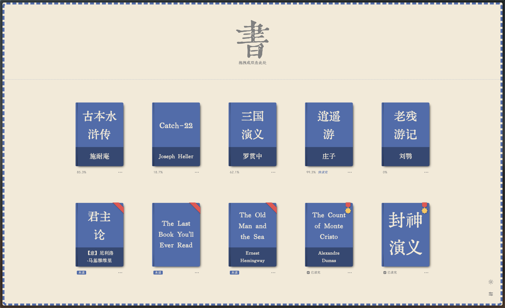

<!-- markdownlint-disable MD033 MD041 -->
<div align="center">

<a href="https://reader.yijian.app" target="_blank">
    
</a>

<br>

<a href="https://opensource.org/licenses/MIT" target="_blank">
    
</a>

<br/><br/>

<a href="README.md">中文</a> | <a href="README_EN.md">English</a>

</div>

易笺是一款简单纯粹的 TXT/EPUB 阅读器，让朴素的纯文本书籍拥有精致优雅的阅读体验。

本项目基于 [henryxrl/SimpleTextReader](https://github.com/henryxrl/SimpleTextReader)（原版）和 [cataerogong/SimpleTextReader](https://github.com/cataerogong/SimpleTextReader)（增强版）开发，整合了两者的功能并新增了 EPUB 支持、无限滚动易触发模式、匿名模式等特性。



## 功能来源说明

本项目的功能来自三个部分，下面逐一标注来源：

### 原版功能（henryxrl）

原版 [henryxrl/SimpleTextReader](https://github.com/henryxrl/SimpleTextReader) 提供的核心功能：

1. 百兆文件秒开，支持自动识别文件编码
2. 中英文小说名、作者名自动识别（`《书名》作者：作者名.txt`、`书名.[作者].txt`、`Bookname by author.txt`）
3. 中英文标题正则自动识别，支持 `[::]` 手动标记标题行
4. 自动抓取脚注（① 到 ㊿）
5. 界面语言随文件自动切换（中/英）
6. 自动去除文字广告
7. 自动制作扉页与藏书章
8. 自动储存阅读进度（精确到行）
9. 书架功能，自动生成书籍封面
10. 最多 3 种自定义字体（TTF/OTF）
11. 十二款网络字体（需联网）
12. 暗黑模式、PWA 支持
13. 无限滚动模式（滚到底/顶后继续滚动翻页）
14. 设置菜单（字体大小、行高、主题颜色等）
15. 浏览器历史导航

**浏览器插件**（Chrome / Firefox / Edge）为 henryxrl 原版发布，版本号 v1.6.9.5：

- [Chrome 插件](https://chrome.google.com/webstore/detail/%E6%98%93%E7%AC%BA/dbanahlbopbjpgdkecmclbbonhpohcaf)
- [Firefox 插件](https://addons.mozilla.org/zh-CN/firefox/addon/yijian/)
- [Edge 插件](https://microsoftedge.microsoft.com/addons/detail/pabihehbdhldbdliffaddllmjlknmpak)

### 增强版功能（cataerogong）

来自 [cataerogong/SimpleTextReader](https://github.com/cataerogong/SimpleTextReader) 的增强特性：

1. **自动拼接模式（Auto-Join Mode）**：滑动窗口渲染器，滚动时动态加载/卸载页面内容，实现无缝连续阅读（⚠ 实验功能，存在已知 BUG，不推荐日常使用）
2. **全文搜索**：支持正则表达式，向前/向后导航，匹配高亮。快捷键 `F`
3. **快速跳转**：按行号或百分比跳转。快捷键 `G`
4. **日志模式（Log Mode）**：为 `.log` 文件提供简化渲染——跳过标题检测、文本优化和分页，自动识别或手动切换
5. **进度条**：侧边栏垂直滑块，支持快速导航，兼容分页和自动拼接模式
6. **行号显示**：所有内容元素带 `data-line-num` 属性，通过设置开关切换
7. **阅读器模式设置**：自动/书本/日志三种模式可选

### 本项目新增功能

本仓库（sixiang-world）在上述基础上新增：

1. **EPUB 格式支持**：通过 JSZip 解压 + OPF 解析 + XHTML 结构转换，将 EPUB 内容接入现有 TXT 渲染管线。所有 TXT 阅读功能（分页、目录、暗黑模式、字体、书架、进度）对 EPUB 自动生效
2. **EPUB 章节分页**：基于 spine 的章节级分页，替代单页渲染
3. **EPUB 目录映射**：NCX/TOC 条目映射到行号，侧边栏可点击跳转
4. **EPUB 书架持久化**：EPUB 文件可保存到书架，支持重新打开时恢复进度
5. **EPUB 语言检测**：自动识别 EPUB 语言并切换界面
6. **EPUB 图片还原**：EPUB 内图片以 base64 data URL 内联渲染（PNG/JPEG/GIF/SVG/WebP/AVIF/BMP），外部图片 URL 因隐私保护不加载；缺失图片显示虚线占位符；图片智能分页避免断页
7. **EPUB 样式保真**：保留受控内联样式（text-align/text-indent/font-style/font-weight/margin），值级正则校验防 CSS 注入
8. **EPUB 脚注还原**：识别 `epub:type="footnote"` 脚注与 `noteref` 引用链接，悬停显示脚注弹窗
9. **EPUB 跨章节链接**：行内内部链接（`#fragment` / `chapter.xhtml#sec`）可点击跳转到对应章节位置
10. **EPUB 内联 SVG**：内联 `<svg>` 元素序列化为沙箱 data URL 渲染（浏览器强制禁用脚本），超大 SVG 降级占位
11. **无限滚动修复**：原版 `isActivelyScrolling` 判断条件过严（deltaY < 20），实际鼠标滚轮无法触发翻页。改为超时机制——阈值达到后 300ms 无新滚动事件即自动翻页
12. **无限滚动易触发模式**：降低翻页阈值（1200 → 400），配合无限滚动使用，翻页更丝滑。**推荐与无限滚动同时开启**
13. **匿名模式**：开启后打开的书籍不会出现在书架上，适合临时查看文件
14. **显示书名开关**：可关闭浏览器标签页中的书名显示，始终显示「易笺」

### 推荐翻页设置

> **推荐使用「无限滚动」+「让无限滚动更容易触发」**，两功能配合翻页更丝滑。
> 「自动拼接」为实验功能，存在已知 BUG，不推荐日常使用。

### 界面优化

- 移除设置面板中「排版模式」「自动拼接」「显示行号」三项的冗长描述文字，界面更简洁
- 「连续滚动」更名为「自动拼接」
- 设置面板新增「让无限滚动更容易触发」「显示书名」「匿名模式」等开关
- 无限滚动下方新增功能说明文字

## 使用

### 添加书籍

将 **TXT 或 EPUB 文件**拖入界面（支持批量导入），或双击界面手动选择文件。

### 书架管理

- 点击封面打开书籍
- **Alt/Option + 点击** 强制重新处理
- 顶部筛选栏过滤书籍，支持批量或单本删除

### 阅读功能

- 左侧目录跳转章节
- **← → 方向键** 翻页，或开启无限滚动模式（推荐同时开启「让无限滚动更容易触发」，翻页更丝滑）
- **Page Up / Page Down** 跳转上/下一章
- **F 键** 全文搜索，**G 键** 快速跳转
- **Esc** 返回书架

### 进阶使用（修改 TXT 源文件）

#### 手动标记标题

在任意行首添加 `[]` 标记，指定为标题行：

```txt
[::] 写在故事的最后
```

#### 使用脚注

插入 ① 到 ㊿ 引用脚注，脚注行以对应数字符号开头：

```txt
北冥①有鱼，其名为鲲②。
①北冥：北海，因海水深黑而得名。
②鲲（kūn）：本义鱼子，小鱼。
```

## Docker 部署

v2 镜像仅含静态前端（Vite 构建产物 `dist/`），由 Caddy 静态服务，暴露 `:80`。先从仓库根构建镜像：

```bash
docker build -t simplereader .
```

基础运行（映射到宿主 8866）：

```bash
docker run -d --name simpletextreader \
-p 8866:80 \
--restart unless-stopped \
simplereader:latest
```

挂载本地图书库目录（`books/` 是 Caddy 静态服务的卷）：

```bash
docker run -d --name simpletextreader \
-p 8866:80 \
-v /path/to/your/books:/srv/books \
--restart unless-stopped \
simplereader:latest
```

> 注：原版 `henryxrl/simpletextreader` 镜像基于 v1（Node + Express + Prisma 后端，`:8866`），**与本 fork 的 v2 静态镜像不兼容**，请使用上述自建镜像。

## URL 参数（调试用）

在 URL 末尾添加 `?param`，多个参数用 `&` 连接：

| 参数 | 说明 |
|---|---|
| `no-bookshelf` | 禁用书架 |
| `no-settings` | 禁用设置菜单 |
| `no-fast-open` | 禁用快速打开（等处理完再显示） |
| `no-pagebreak-on-title` | 按行数分页而非按章节 |
| `always-process` | 强制每次打开都重新处理 |
| `print-db` | 打印数据库内容 |
| `upgrade-db` | 手动升级数据库 |

---

## 开发

本项目使用 **Vite** 作为构建工具，**pnpm** 作为包管理器。

```bash
# 安装依赖
pnpm install

# 启动开发服务器（默认端口 3000）
pnpm run dev

# 生产构建（输出到 dist/）
pnpm run build

# 运行全部单元测试（共 22 个测试文件）
pnpm run test
```

### 项目结构（v2 重构）

```
client/
  src/                      # 源码（ES modules）
    app.js                  # 应用入口
    init-webpage.js         # 页面初始化（语言/主题/SVG 图标）
    config/                 # 配置常量、运行时变量、Schema
    core/                   # 架构扩展：Hook 系统、预设管理、配置同步
    components/             # 可复用 UI 组件
    modules/
      reader/               # 阅读器核心（分页、脚注、搜索、跳转）
      bookshelf/            # 书架管理
      settings/             # 设置（状态管理 + Schema + 字体基线）
      font/                 # 字体池
      file/                 # 文件处理与编码检测
      text/                 # 文本处理
      database/             # IndexedDB 存储
      epub/                 # EPUB 解析与转换
    utils/                  # 工具函数
      base/                 # 基础工具（颜色、DOM、格式、路径等）
      helpers/              # 功能模块帮助函数
    styles/                 # CSS（variables.css, main.css, reader.css 等）
  lib/                      # 第三方库（jQuery, tippy, JSZip, jschardet…）
  fonts/                    # 字体文件
  images/                   # 图片资源
  manifests/                # 浏览器扩展清单（Chrome / Firefox / PWA）
shared/                     # 前后端共享的核心逻辑
archive/                    # 历史存档（server/, debug/ 等）
test/                       # 单元测试（22 个测试文件，Node 原生 assert）
```

## v1 → v2 迁移说明（破坏性变更）

本版本（v2.0.0 起）是一次重大重构，**不向后兼容 v1**。升级前请阅读以下要点：

1. **服务端已废弃**：原 `server/`（Node + Express + Prisma，含 `/api/library/*`、`/api/auth/*`、登录体系与书架数据库）已归档至 `archive/server/`。**v2 镜像仅为静态前端**（Vite 构建产物），由 Caddy 或任意静态服务器托管。旧版部署在服务器端的书架数据**没有迁移脚本**，升级后需重新导入书籍。
2. **配置同步安全模型变更**：v1 使用会话鉴权；v2 改为「明文令牌」模式——令牌即存储键，直接拼在 URL 中（`https://textdb.hunluan.space/{token}`），会出现在服务器访问日志与浏览器历史中。**仅同步阅读偏好，不要使用含敏感信息的令牌。**
3. **同步数据格式 v2（不向后兼容）**：数据格式升级为 `{_meta:{v:2}, key:{v,ts}}` 字段级时间戳结构，与 1.x 客户端的扁平格式不兼容。**多设备请统一升级到 ≥2.0.0**，否则旧客户端读取 v2 数据会失败。
4. **`isOnServer` 已废弃**：客户端不再有「书籍在服务器上」的概念，相关 UI 与字段已清理。

升级建议：重新构建镜像（不要对旧 `:latest` 直接覆盖到不兼容环境），导出本地书籍备份后再升级。

---

### 本项目仅用于学习交流使用，请勿用于商业用途
